# Space Escape [](https://opensource.org/licenses/MIT)
> ## **[Play Space Escape!](https://space-escape.herokuapp.com)** 
> ## **[GitHub Repo!](https://github.com/pbyakod/space-escape)** 

### You're a lone space traveler deep in space trying to navigate your way back home. Along the way, you'll encounter many new places and challenges. Can you make it?

---

## Table of Contents 
1. [Background](#background)
2. [Technologies](#technologies)
3. [Features](#features)
4. [Installation](#installation)
5. [Instructions](#instructions)
6. [License](#license)
7. [Code](#code)
8. [Authors](#authors)
9. [Credits](#credits)

---
## Background

* Inspiration
Excited to create game of some sort, our five person team (members of the UC Berkeley Extensions Full-Stack Bootcamp) felt motivated and confident to build a complex project that stretched our knowledge of ReactJS. The game we created takes inspiration from simplistic computer games of the past such as Oregon Trail and Mario Party, while also giving it a modern and comedic flare referencing popular culture surrounded by the theme of the modern day space race. 

* Instructions 
Create an account, choose a character, and start playing! Each location contains an encounter in which you will make a user decision, or play a minigame.

* License
This application is using the MIT license. 

---

## Technologies
* Front-End
  - [HTML](https://www.w3schools.com/html/)
  - SCSS & [CSS](https://www.w3schools.com/css/)
  - [Javascript](https://www.javascript.com/) (JSX)
  - [Excalidraw](https://excalidraw.com/)
  - [Local Storage](https://developer.mozilla.org/en-US/docs/Web/API/Window/localStorage)
  - [howler.js](https://howlerjs.com/)
  - [Chart.js](https://www.chartjs.org/)
  - [anime.js](https://animejs.com/)
  - [axios](https://www.npmjs.com/package/axios)

* Back-End
  - [Node.js](https://nodejs.org/en/)
  - [npm](https://www.npmjs.com/)
  - [Express](https://expressjs.com/)
  - [MySQL](https://www.mysql.com/)
  - [Sequelize ORM](https://sequelize.org/)
  - [JWT](https://jwt.io/)

---

## Features
### **Game structure**
The game played by the user is, at high-level, a loop through various components handled by conditionally rendering those components. To illustrate, the drawing shows the component names and the loop that we create:

<p align="center">
    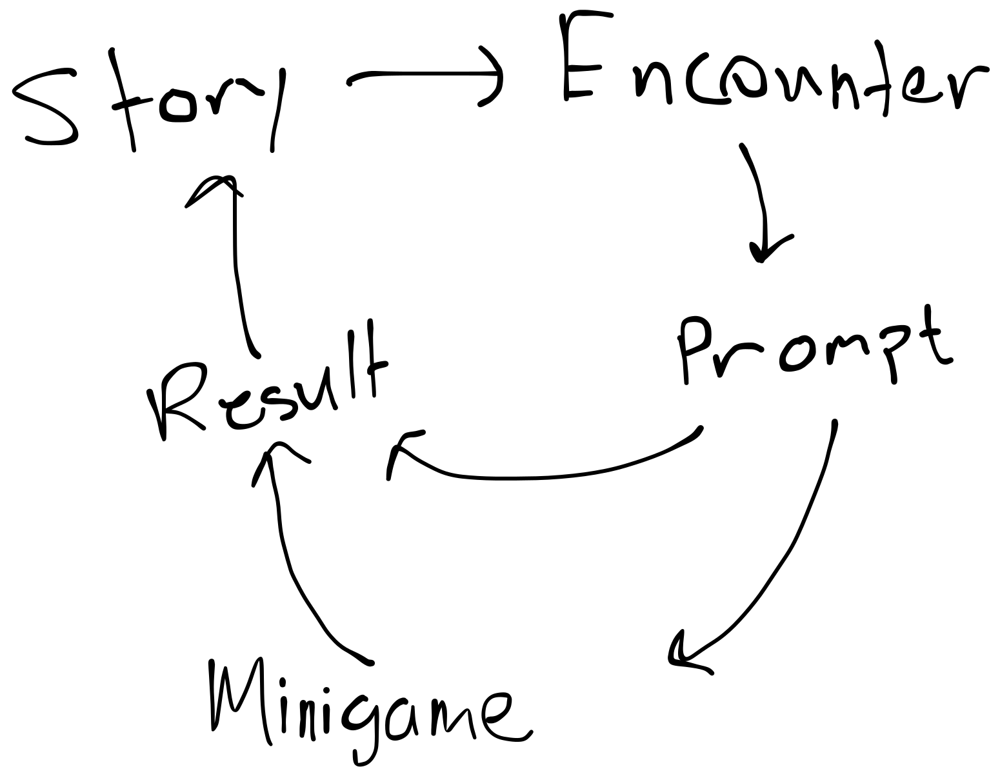
</p>

Within the game component, we import our global state variable which keeps track of the currently rendered component by saving a boolean associated with each component we want to render:

<p align="center">
    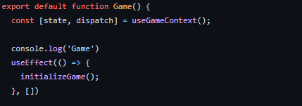
</p>

<p align="center">
    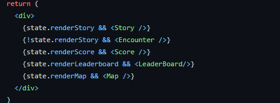
</p>


In each sub-component, we can dispatch actions to change which component is rendered based on the user's input. As an example of a simple component, the `Story` component contains a continue button 

<p align="center">
    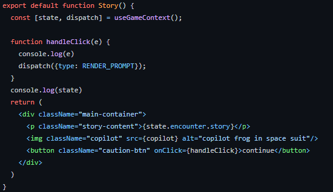
</p>

That continue triggers a call of dispatch with an action to render the prompt component which is inside the `Encounter` component. This code pattern is the general approach we take to rendering other components within the game component.

### **Minigames**
When presented with new encounters, the user can make a choice: one of those choices can lead them to a direct outcome, affecting their character stats or they can possibly choose an option that requires them to play a minigame. To create a game that matched our theme, we wanted something fairly complex but not something that would hinder our learning of ReactJS. We chose to use a tutorial on creating an asteroid game in static HTML, but then convert that into something we can integrate into a React app. The Collect Gold and Pelters minigames were based off of the same functions used in the asteroids game, but tweaked in a way that we chose.

  *  See [freeCodeCamp.org](https://www.youtube.com/watch?v=H9CSWMxJx84) for how the minigame is created.

  * Each game includes home page, rules page, prepare page, game page and result page

    * Asteroids
    <p align="center">
      
    </p>
    * Collect Gold
    <p align="center">
      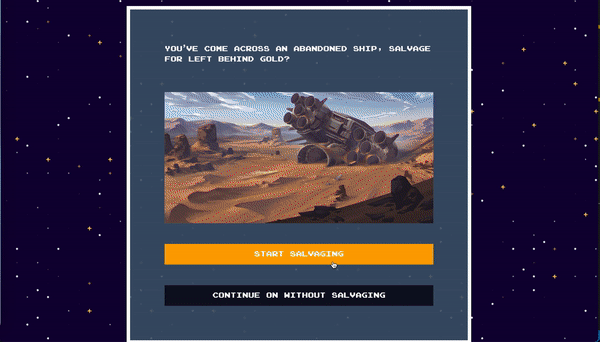
    </p>
    * Pelters
    <p align="center">
      
    </p>

Using the same coding pattern as above, we render minigames by creating a component for a individual minigame; in this case we have three minigames:

<p align="center">
  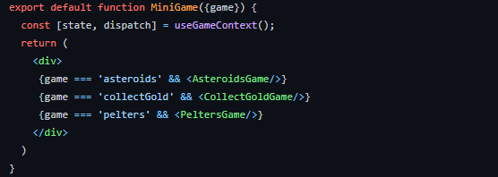
</p>


Components within each minigame contain an opening screen, rules, prepare screen, the minigame (canvas), and the results page. To tie the sub components together, we have a file containing each component conditionally rendered:

<p align="center">
  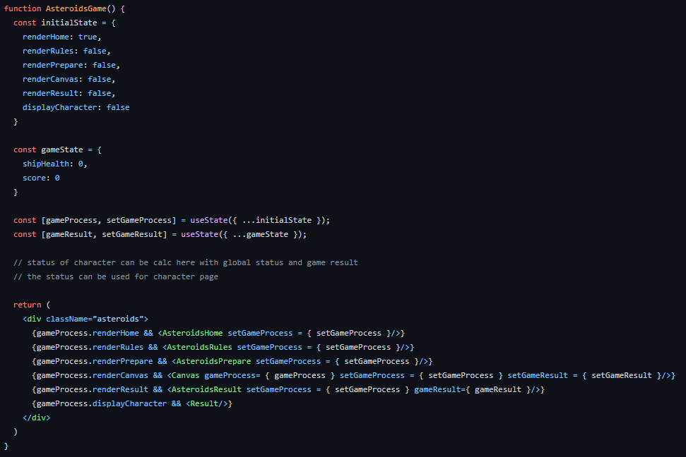
</p


### **Authentication** 
User authentication is necessary for us allow users to have saved game data and ensure that only the right user can continue or delete their games. 

To authenticate users, we implement [JSON Web Tokens](https://jwt.io/) that are created on user login or sign up, and store in local storage.

**Backend**:
On user login through the browser, the user's username and password are sent to the server via a ```POST``` request to `/api/user/login`. This route checks the password against the hashed password, signs a token (24 hour expiration) with the user information, and sends the token back to the frontend for saving a session:

<details>
  <summary>Code snippet: show user route image</summary>
  <p align="center">
	  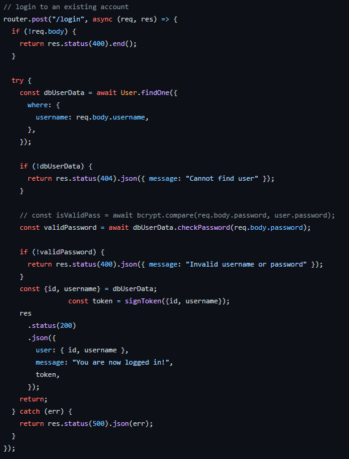
  </p>
</details>

The sign up route is similar, with the only difference being that the user is created.

Once the user has the token save in local storage, any requests to the backend will be checked for an `authorization` header and the logic is taken care of in this `withAuth` function
 
 <p align="center">
	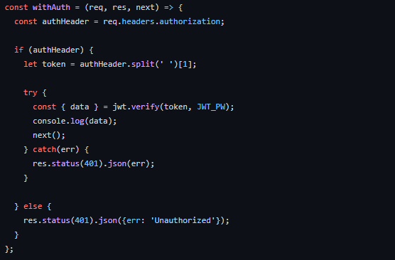
</p>

To protect an entire set of routes, we can specify at the top of the file containing that set of routes.

**Frontend**:
Once the user is logged in, any of the fetch requests requiring authentication need to contain an authorization header. Using [`axios`](https://www.npmjs.com/package/axios), we specify an option containing our generated authorization request header:

<details><summary>Code snippet: view generation and sending of token</summary>
  <p align="center">
    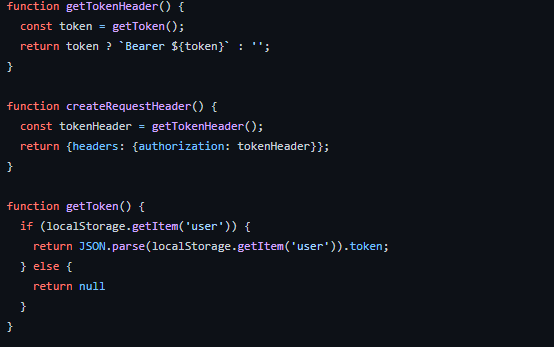
  </p>


  <p align="center">
    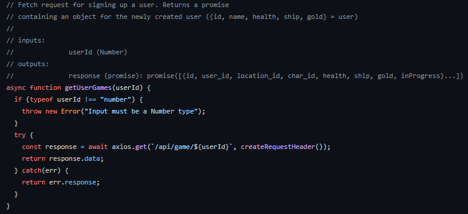
  </p>
</details>

<details>
  <summary>GIF demonstration: see sign up</summary>
   
</details>

<!-- * User can sign up a new account or sign in an existing account. The `JWT` and `local storage` is implemented to check the authentication

   -->

### **Selecting a character**
<details><summary>GIF demonstration: select character</summary>
* Player is able to start a new game or continue an incompleted game. They can also delete a certain game record

* Player can select character at the beginning of the game which is with different `health`, `ship health`, `gold` value

  
</details>

<!-- * When the player reached a certain location, there would be a corresponding encounter which includes two options directed to different results

  
 -->

--- 

# Authors
- Peter Consagra | [GitHub](https://github.com/Pcon27) | [Portfolio](https://pcon27.github.io/myNewWebsite/)
- Denzal Martin | [GitHub](https://github.com/dmartin4820) | [Portfolio](https://dmartin4820.github.io/)
- Troy Johnson | [GitHub](https://github.com/tnj415) | [Portfolio](https://tnj415.github.io/improved-portfolio/)
- Quishuang Tian | [GitHub](https://github.com/qtian13) | [Portfolio](https://qtian13.github.io/react-portfolio/)
- Pranav Byakod | [GitHub](https://github.com/pbyakod) | [Portfolio](https://pbyakod.github.io/portfolio/)
---

# Credits

Thank you to the UC Berkeley Bootcamp teaching staff for providing the resources and help to us in completing this project.
