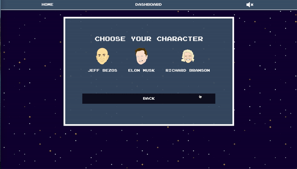
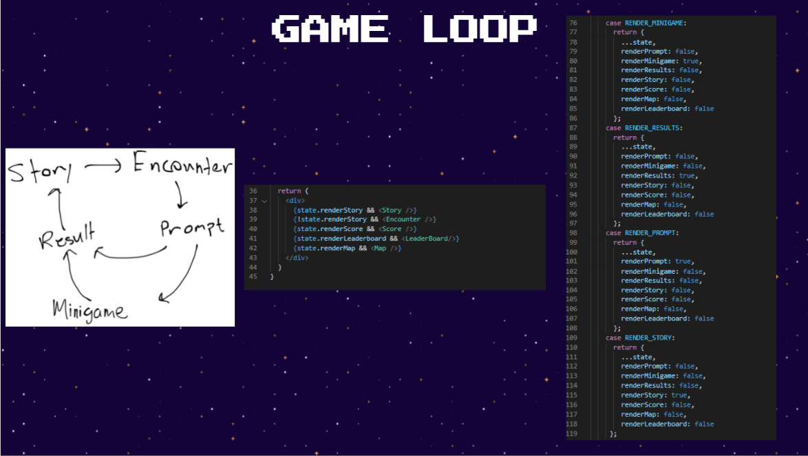

# Space Escape 
> ## **[Play Space Escape!](https://space-escape.herokuapp.com)** 
> ## **[GitHub Repo!](https://github.com/pbyakod/space-escape)** 

### You're a lone space traveler deep in space trying to navigate your way back home. Along the way, you'll encounter many new places and challenges. Can you make it?

---

# Table of Contents 
1. [Background](#background)
2. [Technologies](#technologies)
3. [Installation](#installation)
4. [Instructions](#instructions)
5. [License](#license)
6. [Code](#code)
7. [Authors](#authors)
7. [Credits](#credits)

---
# Background

## Inspiration
Excited to create game of some sort, our five person team (members of the UC Berkeley Extensions Full-Stack Bootcamp) felt motivated and confident to build a complex project that stretched our knowledge of reactJS. The game we created takes inspiration from simplistic computer games of the past such as Oregon Trail and Mario Party, while also giving it a modern and comedic flare referencing popular culture surrounded by the theme of the modern day space race. 

## Instructions 
Create an account, choose a character, and start playing! Each location contains an encounter in which you will make a user decision, or play a minigame.

## License
This application is using the MIT license. 

---

# Technologies
## Front-End
- [HTML](https://www.w3schools.com/html/)
- SCSS & [CSS](https://www.w3schools.com/css/)
- [Javascript](https://www.javascript.com/) (JSX)
- [Excalidraw](https://excalidraw.com/)
- [Local Storage](https://developer.mozilla.org/en-US/docs/Web/API/Window/localStorage)
- [howler.js](https://howlerjs.com/)
- [Chart.js](https://www.chartjs.org/)
- [anime.js](https://animejs.com/)

## Back-End
- [Node.js](https://nodejs.org/en/)
- [npm](https://www.npmjs.com/)
- [Express](https://expressjs.com/)
- [MySQL](https://www.mysql.com/)
- [Sequelize ORM](https://sequelize.org/)
- [JWT](https://jwt.io/)

---

## Features

* User can sign up a new account or sign in an existing account. The `JWT` and `local storage` is implemented to check the authentication

  

* Player is able to start a new game or continue an incompleted game. They can also delete a certain game record

* Player can select character at the beginning of the game which is with different `health`, `ship health`, `gold` value

  

* When the player reached a certain location, there would be a corresponding encounter which includes two options directed to different results

  

* Minigame

  *  We reference to [freeCodeCamp.org](https://www.youtube.com/watch?v=H9CSWMxJx84) for minigame

  * Each game includes home page, rules page, prepare page, game page and result page

    * Asteroids

      

    * Collect Gold

      

    * Pelters

      

--- 

# Authors
- Peter Consagra | [GitHub](https://github.com/Pcon27) | [Portfolio](https://pcon27.github.io/myNewWebsite/)
- Denzal Martin | [GitHub](https://github.com/dmartin4820) | [Portfolio](https://dmartin4820.github.io/)
- Troy Johnson | [GitHub](https://github.com/tnj415) | [Portfolio](https://tnj415.github.io/improved-portfolio/)
- Quishuang Tian | [GitHub](https://github.com/qtian13) | [Portfolio](https://qtian13.github.io/react-portfolio/)
- Pranav Byakod | [GitHub](https://github.com/pbyakod) | [Portfolio](https://pbyakod.github.io/portfolio/)
---

# Credits

Thank you to the UC Berkeley Bootcamp teaching staff for providing the resources and help to us in completing this project.
